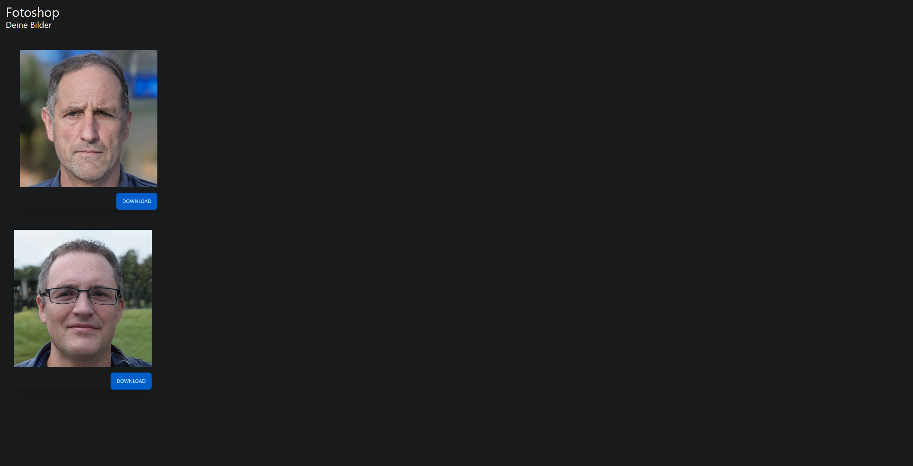

# Web | Fotoshop

## Aufgabenstellung
Es wird eine Website zur Verfügung gestellt, in dem man als authentifizierter Nutzer (Zugangsdaten sind in der Aufgabenstellung dabei) 2 Fotoaufnahmen von Personen (Bilder) sehen kann.

> Du bekommst von deinem Fotografen Zugangsdaten zu seinem Fotoshop, um dir deine Bilder herunterzuladen. Ein anderer Kunde hat sich eine Flag fotografieren lassen.
> Findest du die Lücke?
> Deine Zugangsdaten lauten: Benutzername: user Passwort: password

## Lösungsansatz
Schaut man sich die Bilder etwas genauer an und achtet auf die URL erkennt man, dass diese über ein PHP-Skript im Backend geladen werden. Die URL lautet wie folgt: /thumbnail.php?image=0001.png

Anhand dieser Tatsache, habe ich mehrmals die Nummer des Bildes in der Url geändert und somit bei der Url /thumbnail.php?image=0014.png die FLag `DBH[idor_ftw]` gefunden.

## Punkte
50 Punkte - 248 Solves
